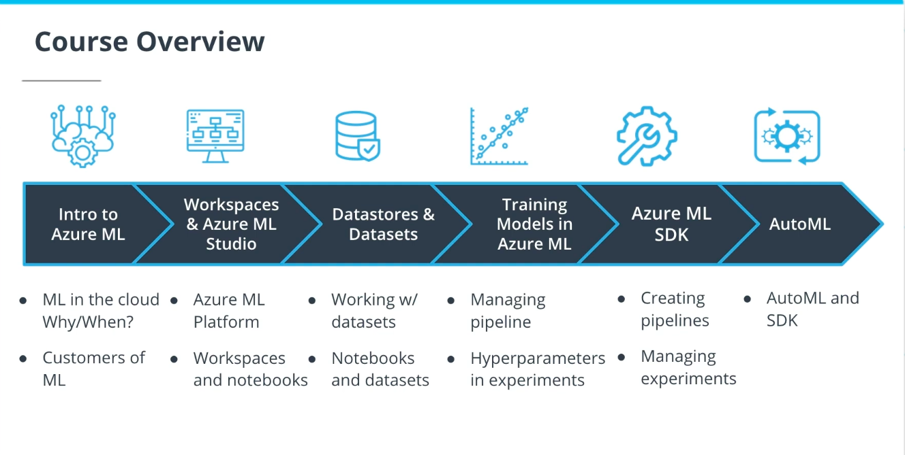

___

# Course Overview

## Lesson 1: Introduction to Azure Machine Learning

* **What You'll Build :**  We'll have a look at a preview of what you'll build on your final project.

* **Why Do ML in the Cloud :** We'll go over some key reasons why you would want to do Machine Learning (ML) in the cloud. We'll look into some of the limitations of performing ML locally on your machine, as well as how the cloud addresses these limitations.

* **When to Do ML in the Cloud :** Most of the time the cloud is your best option for ML. But we'll discuss a few edge cases in which using the cloud may not be the best route.

* **Customers of ML :** We'll look at the different customers of machine learning, including both internal and external customers.

---

## Lesson 2: Workspaces and AzureML Studio

* **The Azure ML Platform :** We'll talk about the core features of the Microsoft Azure ML platform and how they enable you to be more productive as a data scientist or machine learning engineer.

* **Workspaces and Notebooks :** Workspaces and notebooks are critical components of Microsoft Azure. We'll learn how these tools enable you to be a more effective data scientist—including the use of Jupyter to build and deploy machine learning models.

---

## Lesson 3: Datastores and Datasets
* **Datastores and Datasets :** Datastores and Datasets are a critical component of cloud computing. We'll learn how Azure allows you to easily integrate third party datasets and open datasets into our ML pipeline to quickly develop working solutions.

---

## Lesson 4: Training models in Azure
* **Managing pipelines :** We'll cover how to create a pipeline that you manage yourself using the console, which will alow you to make very small changes that can be run repeatedly.

* **Hyperparameters in experiments :** We'll learn how to use hyperparameters in experiments, including how we can automate the creation of hyperparameters and make very small changes that create huge value in terms of prediction accuracy.

---

## Lesson 5: Azure ML SDK

* **Creating pipelines :** We'll talk about how the Azure ML SDK allows us to programmatically create pipelines. By automating the creation of pipelines, we can create more pipelines; also, our pipeline creation becomes a a repeatable process that other members of our team can follow.

* **Managing experiments :** We'll learn how to use the SDK to manage experiments programmatically with Python, allowing us to easily rerun our processes using Python scripts.

---

## Lesson 6: Automated Machine Learning and Hyperparameter Tuning

* **Automated ML and SDK :**  We'll discuss how we can use the Azure ML SDK to do Automated ML and create models more quickly and accurately.

* **Model Interpretation:** We'll explore how model interpretation allows us to build solutions using Automated ML that we (and others) can more easily interpret, making visible the core features that are driving the model.

## Project: Creating and Optimizing an ML Pipeline

* In the project at the end of this course, you'll have the opportunity to create and optimize an ML pipeline. You'll do this both using HyperDrive and also Automated ML, so that you can compare the results of the two methods.

---
