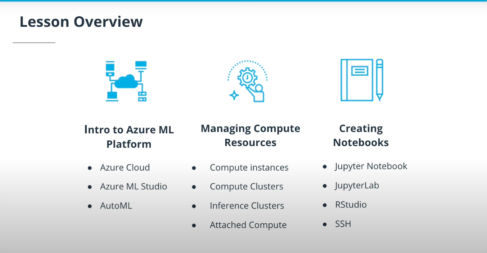
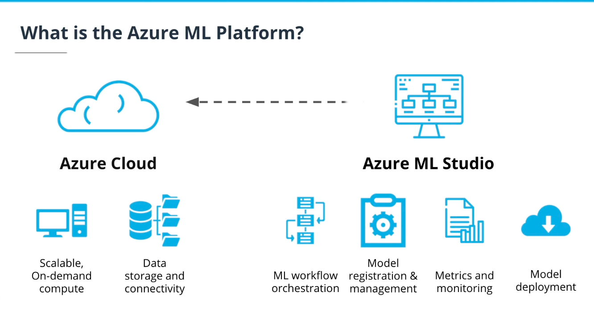
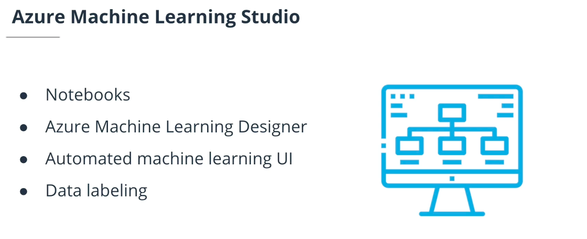
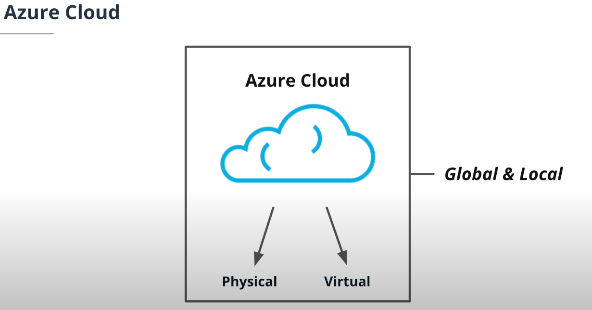
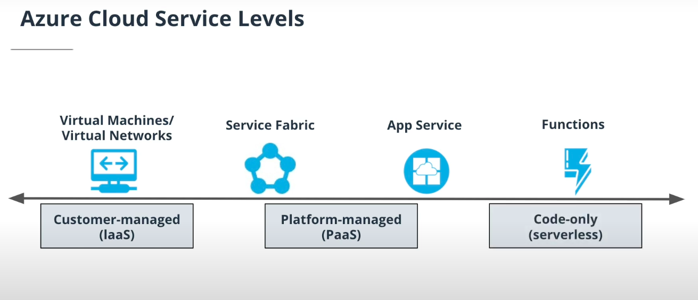
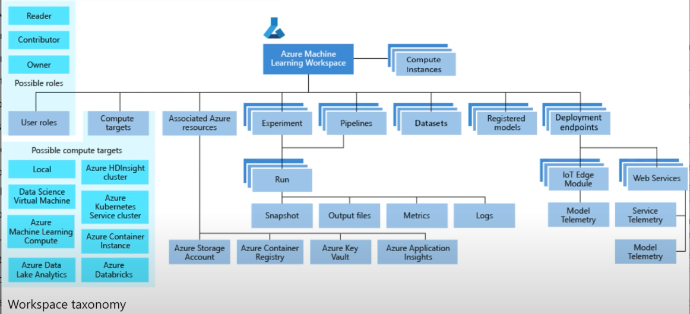
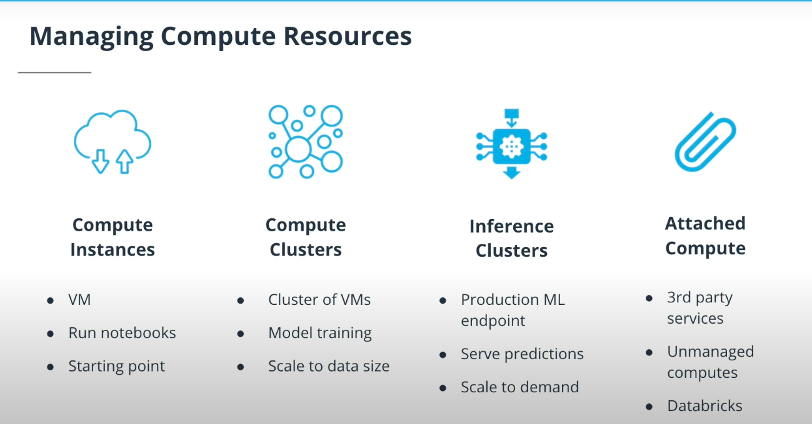
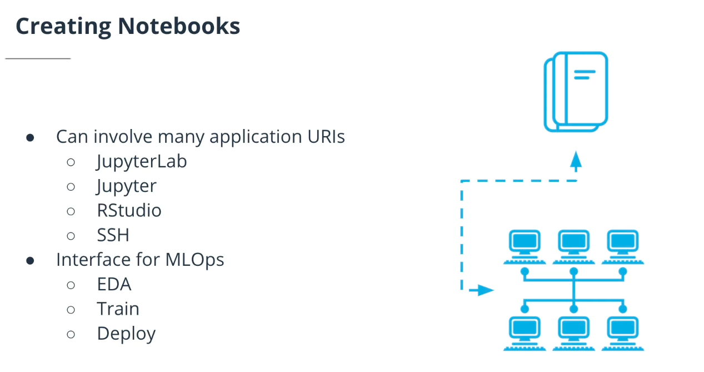

---
# Lesson Overview

* **The Azure ML Platform :** We'll talk about the core features of the Microsoft Azure ML platform and how they enable us to be more productive as data scientists or machine learning engineers—including how elastic resources give us the power to do ML at scale.

* **Managing and choosing compute resources :** We'll explore the role of compute instances, compute clusters, inference clusters, and attached compute. We'll also consider the tradeoffs involved in choosing resources, such as GPU vs CPU, VM size, cluster size, and dedicated vs low-priority instances.

* **Workspaces and Notebooks :** Workspaces and notebooks are critical components of Microsoft Azure. We'll learn how these tools enable you to be a more effective data scientist—including the use of Jupyter to build and deploy machine learning models.

___

# Intro to Azure ML Platform

---

---

---

---

* The Azure ML platform is composed of two main components: 
	* The Azure Cloud  
	
	* Azure ML Studio.

* Key features of Azure Cloud include:

	* Scalable, on-demand compute instances.
	
	* Data storage and connectivity.

* Key features of Azure ML studio include:

	* The ability to easily orchestrate machine learning workflows.
	
	* Model registration and management (or MLOps). This allows you to register models or track them and control the lineage.
	
	* Metrics and monitoring, giving you the ability to look at the compute, the storage, or a training job, and make sure that it's running effectively.
	
	* Model deployment; you can create an inference end point and deploy your model so that it runs 24/7 and is elastically scaled to meet demand.

# Managing Compute Resources

Managing compute resources effectively involves several main components:

#### Compute instances

* A central component of managing compute resources involves the ability to spin up a Virtual Machine (VM), provision the correct resources for that VM, and then launch a notebook—which you can then use to control other components of your project, such as by calling out to a compute cluster.

#### Compute clusters

* A compute cluster is a specialized cluster of Virtual Machines used to train ML models at scale, adjusting elastically to the requirements. Compute clusters can also employ specialized GPU or CPU resources.

#### Inference clusters
* Inference clusters, as the name suggests, are used to establish a production ML endpoint and serve out predictions. Like compute clusters, inference clusters are also groups of Virtual Machines—and like compute clusters, they too can scale up and down in response to demand, thus ensuring that your customers always have a good response time. Inference clusters can be configured to do monitoring and logging, and set up to ensure that the model is running 24/7.

#### Attached compute

* Attached compute, or "unmanaged compute," allows you to do integration with third party services. Those third party services could be anything from your own VM to something like a data bricks cluster that does managed Spark. If you have experience with a tool from, say, a previous job, you can integrate that tool with Azure ML Studio and thus use that pre-existing skill in your pipeline.

---

---

