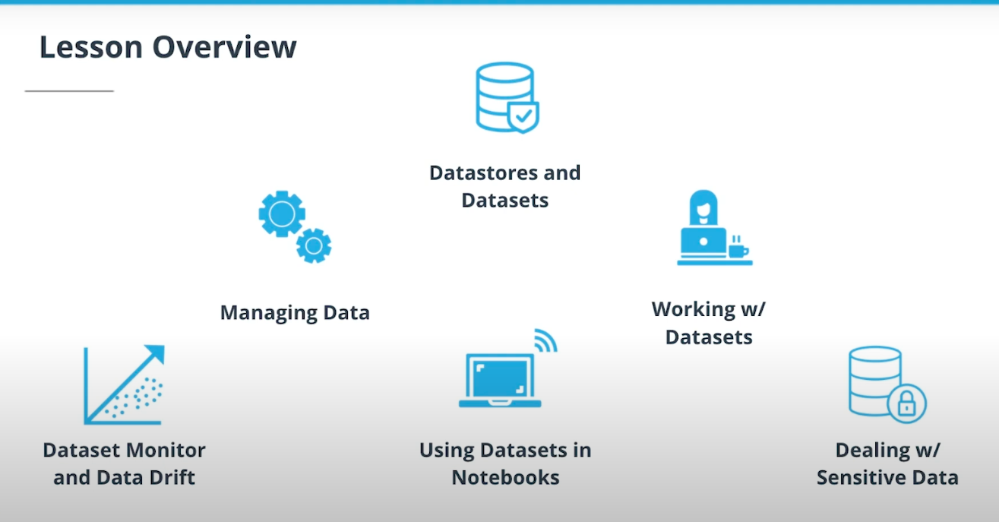
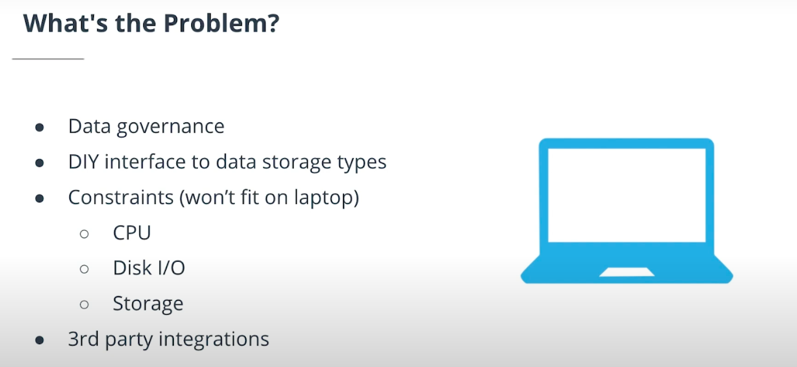
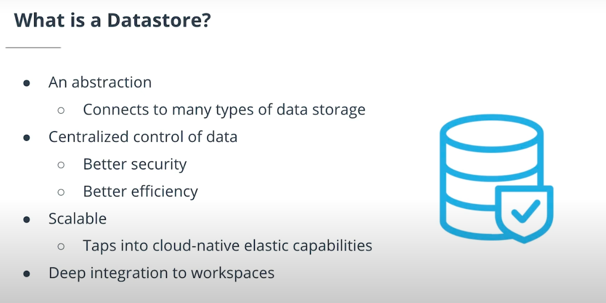
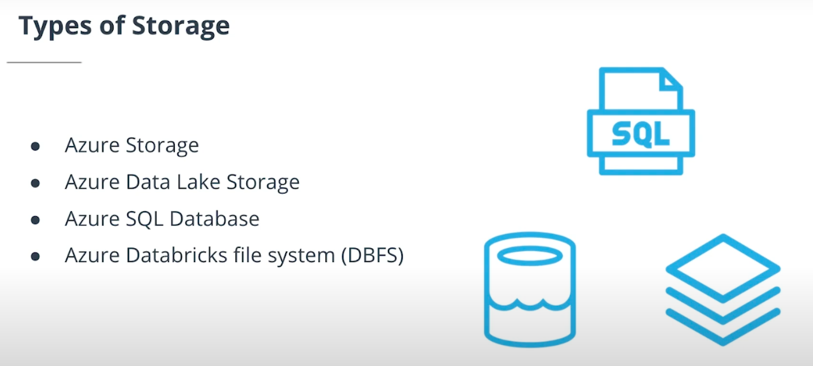
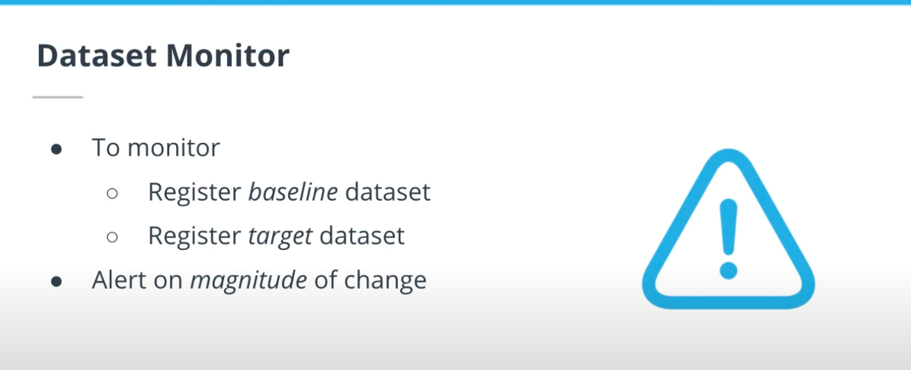
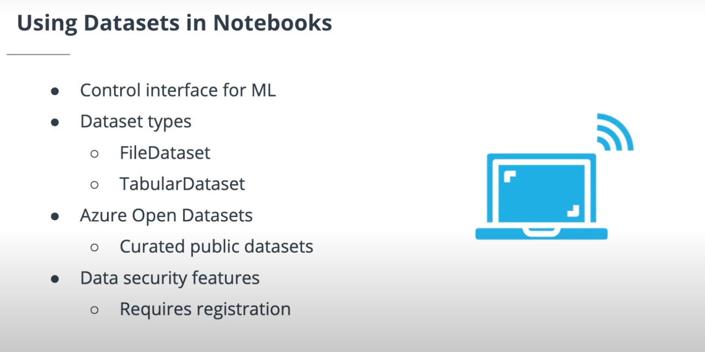
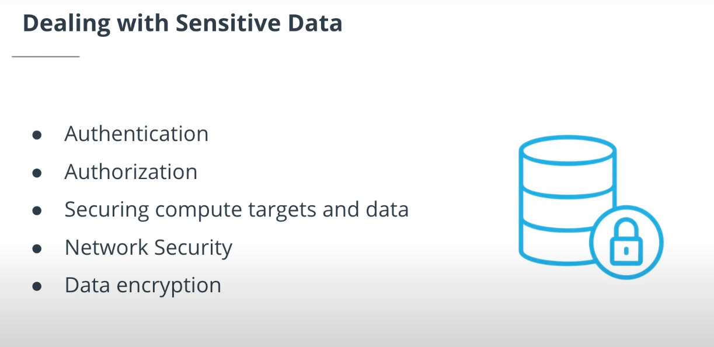
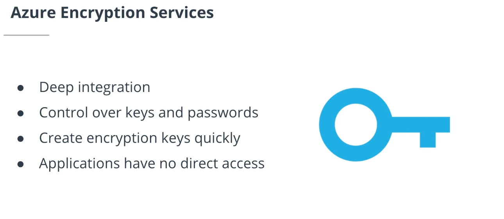

# Lesson Outline: Datastores and Datasets

* This lesson is all about managing data by using Datastores and Datasets. Here are the main topics we'll cover:

#### Managing data :
	
* We'll talk about some of the MLOps workflows that are enabled by managing data within the Azure ML studio platform.

#### Working with Datasets :
	
* Working with datasets is critical for sharing data and having a high performance pipeline that doesn't require copying the data back and forth.

#### Dataset monitoring and data drift : 

* If you collect your data, train a model, and then you get some new customers, those new customers may not be the correct target for the model that you created previously—you may need to recreate the model to get a better fit. With Dataset monitoring, you can detect those changes.

#### Using Datasets in notebooks : 
	
* We'll cover the workflow for using Datasets in notebook, and we'll show you how you can leverage the open Datasets that are available in Azure.

#### Dealing with sensitive data : 

* One of the most important topics in ML is how to handle personally identifiable information and protect it using encryption.

---

# Managing Data in Azure Machine Learning

---

---

---

# The Problem: Managing Data Without the Cloud

* To understand why we need Datastores—and cloud-based data storage more generally—it helps to first consider the alternative. If you were trying to handle the data on your own local machine, you would be faced with a number of challenges, including:

#### Data governance 

If you have secret or sensitive data that you need to keep protected, data governance becomes a concern.

#### Do-It-Yourself (DIY) interface to data storage types :

You will have to write a bunch of extra code to connect different storage types (such as SQL or Databricks).

#### Hardware constraints : 

Your machine's resources (e.g., CPU, disk IO, storage) are limited.

#### Third party integration : 

If you want to use an off-the-shelf, third party tool, this could pose integration problems—and you will have to handle the integration problems on your own.

### The Solution: The Azure Cloud and Datastores

Datastores have a number of key properties that address the above challenges:

1. Easy-to-use interface for many storage types. A Datastore is essentially an abstraction that provides easy methods to interact with many different tools and with many different complex data storage types. This removes the extra work of struggling with third-party integrations and writing do-it-yourself interfaces for different data storage types.

2. Secure, centralized control of the data. This means you don't need to have separate systems that move your data to different locations which results in better efficiency. You don't have to copy the data back and forth; instead, your ML projects can simply use copies derived from that centralized data. This centralized control also includes built-in encryption and thus results in better security.

3. Scalability. Datastores leverage cloud-native elastic storage, meaning that they can scale in response to demand. Obviously, this is something your hard drive cannot do.

---

# Working with Datasets

* We'll get into an exercise shortly in which we get some hands-on practice working with datasets. But first, let's make sure we are clear on the relationship between Datastores and Datasets:

	* A Datastore is an abstraction that gives you an easy way to interact with different data storage types.
	
	* A Dataset is a pointer to the location of a data file stored in a Datastore.

---

---

# Dataset Monitor and Data Drift

---

---

* A common problem is that you may train a model on some data and achieve a good fit—but then, over time, new data comes in and the model fits less and less well. This is called **data drift**. You can use Dataset monitor to address this problem. Essentially, the process is:

#### Register a baseline Dataset :

This would be a Dataset that has a good fit with your model (commonly you would use the Dataset with which you trained the model).

#### Register a target Dataset :

This might be your model input data that you are receiving over time.
Check for a delta. If there's a specified delta (i.e., a given magnitude of difference) between the baseline and target Datasets, the system will trigger an alert (such as an email) and/or some form of automatic, corrective action (such as re-training the model).

---

# Using Datasets in Notebooks

* Notebooks provide the main control point for interfacing with the Azure ML platform. You can use them to control things like model deployments and distributed training, and they also provide a convenient way to share with other people on your team.

* There are two Dataset types you should take note of:

#### FileDataset : 

This is a generic Dataset type. This is useful for things like computer vision or anything where you need to have a lot of flexibility.

#### TabularDataset : 

As the name implies, this type is for tabular (i.e., table-based) data. This type allows you to handle formats like JSON, CSV, or Parquet.

* As you're getting started using Datasets in Azure notebooks, you may find it very helpful to make use of Azure Open Datasets. These are curated, ready-to-use, public Datasets that you can use to get things running and do ML without needing to worry about collecting your own data.

---

---

# Dealing with Sensitive Data

#### The Principle of Least Privilege (PoLP)

In the video, Noah mentioned a fundamental security principle known as the Principle of Least Privilege or PoLP, which says:

	* We should give users access only to what they need and nothing more.

* Essentially, the more privileges a user has, the more potential there is for them to misuse those privileges. By restricting a user's access rights to only those features they need, we can reduce this potential of misuse.

* You don't need to have a deep understanding of this principle for this course, but if you're curious to learn more about it, you might enjoy this article from the Cybersecurity and Infrastructure Security Agency (CISA) (part of the US Department of Homeland Security). It has a number of examples that are interesting to read and will help make the principle more concrete.

## Security Principles and Practices

* To keep your data from being compromised, you'll want your system to follow some core security principles and practices. Let's briefly review some of the main ones:

#### Authentication :

This is all about who can log in. You want to restrict access using the PoLP principle, so that people who don't need to log in can't log in.

#### Authorization :

This is all about what a user can access once they have logged in. Again, you want to restrict access using the PoLP to make sure that users are only able to access, for example, the folders that they really need to be able to access. A user can only access what they need to access.
Securing compute targets and data. You want to lock down both physical access to the data storage and also online access (e.g., applying best practices, such as firewall rules, to lock down access to open ports).

#### Network security : 

This is all about protecting data from interception. Are you using a VPN to limit access to the network resources? And are you also encrypting the data over the network?

#### Data encryption : 

Data encryption itself encompasses both data at rest and in transit. Obviously, you want to use secure protocols to prevent others from accessing the data. But by making sure the data is encrypted at all times, you ensure that even if the data is somehow breached, it still cannot be used.

---

---

## Azure Encryption Services

To help you ensure your data is secure, Azure has several encryption services that that are deeply integrated with the platform:

* **Increased control over keys and passwords,** making it much easier to implement security best practices as described above.

* **The ability to create and import encryption keys in minutes,** which ensures that you're not having performance bottlenecks by using encryption.

* **Applications have no direct access to encryption keys.** Each service only accesses what it needs, so that If a machine is compromised, this breach won't then open the door to a further attack on your system.

