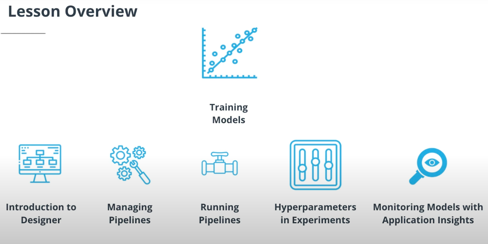

---

# Lesson Outline: Training models in Azure

* This lesson is all about training models. Here's what we'll be covering in this lesson:

#### Introduction to Designer : 
First, we'll learn how we can quickly build our models using the no code/low code, drag-and-drop interface of the Designer.

#### Managing pipelines :

We'll cover how to create a pipeline that we manage ourselves using the console, which will allow us to make very small changes that can be run repeatedly. Our goal in managing our pipelines is to do MLOps—that is, to apply a DevOps-based workflow to ML.

#### Running pipelines :

We'll learn how to run pipelines and experiments, as well as how to look at the output and tune our models.

#### Hyperparameters in experiments :

Finally, we'll learn how to use hyperparameters in experiments, including how we can automate the creation of hyperparameters and make very small changes that create huge value in terms of prediction accuracy.

#### Monitoring models with application insights :

Finally, we'll talk about how we can leverage Azure's Application Insights infrastructure to monitor the performance of our models in production.