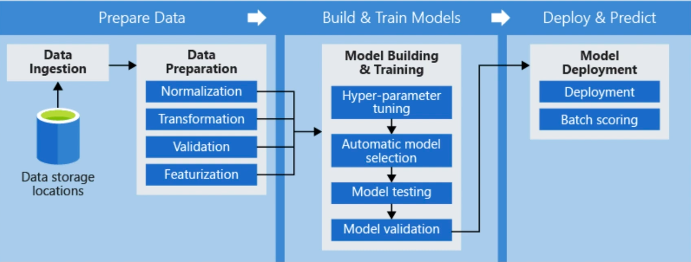

---

# Lesson Outline: Training models in Azure

* This lesson is all about training models. Here's what we'll be covering in this lesson:

#### Introduction to Designer : 
First, we'll learn how we can quickly build our models using the no code/low code, drag-and-drop interface of the Designer.

#### Managing pipelines :

We'll cover how to create a pipeline that we manage ourselves using the console, which will allow us to make very small changes that can be run repeatedly. Our goal in managing our pipelines is to do MLOps—that is, to apply a DevOps-based workflow to ML.

#### Running pipelines :

We'll learn how to run pipelines and experiments, as well as how to look at the output and tune our models.

#### Hyperparameters in experiments :

Finally, we'll learn how to use hyperparameters in experiments, including how we can automate the creation of hyperparameters and make very small changes that create huge value in terms of prediction accuracy.

#### Monitoring models with application insights :

Finally, we'll talk about how we can leverage Azure's Application Insights infrastructure to monitor the performance of our models in production.

---

# Introduction to Designer

---

---

---

* The Designer is a no code/low code interface that allows you to organize resources using a simple drag-and-drop interface. You can use the Designer to build, test, and deploy your ML models. The Designer can be used to organize and configure a variety of resources, including:

	* Pipelines
	* Datasets
	* Compute resources
	* Registered models
	* Published pipelines
	* Real-time endpoints

---

# Managing Pipelines

---

---

---

---

## What is Azure Pipelines?

* Azure Pipelines is a cloud service that incorporates the DevOps approach of Continuous Integration (CI) and Continuous Delivery (CD) to automate your ML workflow. With Azure Pipelines, you can:

	* Automatically build and test your code project
	
	* Share your project with others

## Ways to Run Pipelines

* There are several different tools you can use to control a pipeline in Azure:

* You can use the Designer to set up your pipeline using a low code/no code, drag-and-drops interface.

* You can use the console to go through and adjust an existing pipeline.

* You can use the Azure ML SDK to programmatically control your pipeline with Python.

* You can use a notebook to spin up a pipeline, configure it, and rerun it whenever needed.

## Components of an AzureML Pipeline

* An AzureML pipeline has several main components:

#### Data preparation :

This involves steps like importing, validating, cleaning, wrangling (or "munging"), transforming, normalizing, and staging your data. This step tends to be a large proportion of the work in most ML projects.

#### Training configuration :

A typical training configuration includes steps like parameterization, file paths, logging, and reporting.

#### Training validation :

Training validation involves repeatedly running through your experiment, picking different hardware, compute resources, doing distributed computing, and also monitoring your progress.

#### Model deployment :

The final step is to deploy the model. This typically involves actions like versioning, scaling, provisioning, and configuring access control.

## The Azure Machine Learning Workspace

* A lot of the complicated inner workings of a pipeline are automated for you behind the scenes by the Azure Machine Learning Workspace. You can see this in the diagram below:

---

---

* One key idea to understand is that this system supports an MLOps approach by providing a traceable data lineage—meaning, you have visibility into the process that the data has undergone, including the origin of the data and the root cause of any errors that arise.

---

# Hyperparameters in Experiments

---

---

# Key Tasks for Using Hyperparameters in Experiments

* Using hyperparameters in experiments involves the following key tasks:

	* Define the parameter search space.
	
	* Optimize a chosen metric.
	
	* Specify termination—meaning, define the criteria that say when the process should be terminated.
	
	* Allocate resources, such as selecting the compute clusters you'll use.
	
	* Launch an experiment using an Azure pipeline.
	
	* Visualize the results to see what you actually created.

---

# Monitoring Models with Application Insights

* Once you have deployed an ML model, you need to monitor the model's performance—which you can do using Microsoft Azure's Application Insights. Application Insights is an Application Performance Management (APM) service that is available as a feature of Azure Monitor.

### Metrics for Monitoring Models

* There are a variety of metrics you can use when monitoring your ML models with Application Insights. Some examples are:

	* Request rate : 

	The request rate allows you to figure out how many times your model is being called. If it's being called quite frequently, you may want to have a larger cluster.

	* Response time : 

	For example, if your application is getting very long response times and it's doing computer vision, you might need to switch to a GPU inference end point.

	* Failure rate : 

	If your application is failing more than it should (e.g., it has a 20% failure rate) this is something that you may be able to address with an infrastructure change or by using a different model.

	* Exceptions : 
	You may train a new mode and put it into production, but then find it doesn't fit with the data structure of what your request is expecting—a situation like this will generate an exception, which you can then address.

