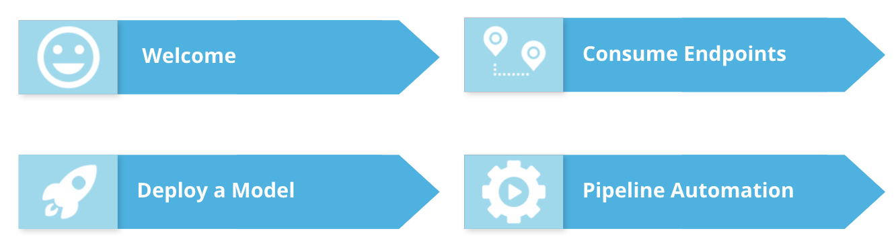

# Introduction to Azure ML

* we will talk about three main points:

#### Deploying a Model

* How to create cluster configuration and compute targets and how to get models into production.

#### Consuming Endpoints
* Consume endpoints to interact with a deployed model in Azure ML Studio.

#### Pipeline Automation

* Some important aspects of pipelines: how to publish one and consume one. Machine Learning operations can greatly benefit directly from automation efforts.

* Machine Learning Operations is related to applying principles of DevOps to Machine Learning, and that will be the focus throughout this course.