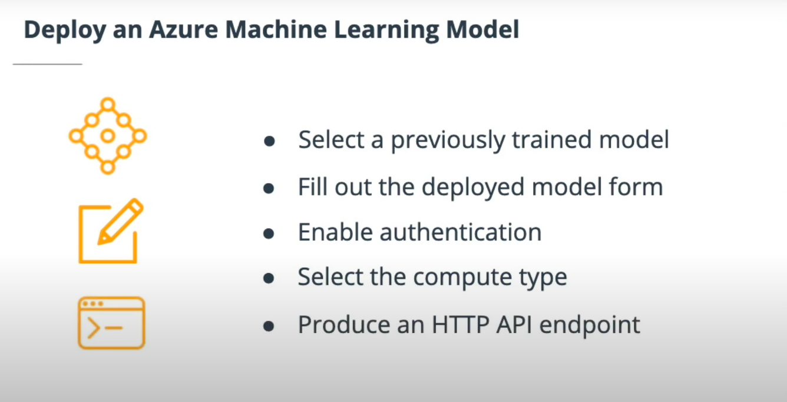

# Deploy a Model 

---

## Introduction

* In this lesson we will talk about model deployments, and what are all the important details you want to be aware of when shipping models into production.

* Deploying a model is a crucial step towards a robust workflow. To get a model into production, several things need to take place. We will cover these topics in this lesson.

	* Enabling Security and Authentication
	* Configuring Deployment Settings
	* Deploying a Model
	* Troubleshooting
	* Benefits of compute instances

---

## Best Practices of DevOps Professionals

* Some of the most important best-practices of DevOps professionals are introduced in this section. Constant evaluation and monitoring, along with a robust deployment is a good way to survive disruptive changes.

#### DevOps: A set of best practices that helps provide continuous delivery of software at the highest quality with a constant feedback loop.

* Chapter 7 of Python For DevOps has an excellent section about logging and troubleshooting.

---

## Enable Security and Authentication :

* Authentication is crucial for the continuous flow of operations. 

* Continuous Integration and Delivery system (CI/CD) rely on uninterrupted flows. 

* When authentication is not set properly, it requires human interaction and thus, the flow is interrupted. 

* An ideal scenario is that the system doesn't stop waiting for a user to input a password. So whenever possible, it's good to use authentication with automation.

---

---

---

### Authentication types

* Key- based
	* Azure Kubernetes service enabled by default
	* Azure Container Instances service disabled by default

* Token- based

	* Azure Kubernetes service disabled by default
	* Not support Azure Container Instances

* Interactive

	* Used by local deployment and experimentation (e.g. using Jupyter notebook)

---

---

---

### Service Principal

* A “Service Principal” is a user role with controlled permissions to access specific resources. Using a service principal is a great way to allow authentication while reducing the scope of permissions, which enhances security.

#### CI/CD : 
	
	* Continuous Integration and Continuous Delivery platform. Jenkins, CircleCI, and Github Actions are a few examples.

	* Further reading: 
		
		* Both the Jenkins and Github Actions websites have good information about their CI/CD platforms and why they are compelling the CI/CD platform.

		* https://www.jenkins.io/

		* https://github.com/features/actions

---

## Implementing Enable Security and Authentication

* In this demo, the Service Principal gets enabled and the many steps of getting to create one are performed successfully.

* Install azure cli packages in terminal 

`pip install azure-cli `

### Several steps are needed to create the Service Principal: 

* Ensure the az command-line tool is installed along with the ml extension

	* The Azure Machine Learning extension allows you to interact with Azure Machine Learning Studio, part of the az command. Ensure it is installed with the following command: `az extension add -n azure-cli-ml`

* Create the Service Principal with az after login in

	`az ad sp create-for-rbac --sdk-auth --name ml-auth`

* Capture the "objectId" using the clientID:

	`az ad sp show --id xxxxxxxx-3af0-4065-8e14-xxxxxxxxxxxx`

* Assign the role to the new Service Principal for the given Workspace, Resource Group and User objectId

	`az ml workspace share -w Demo -g demo --user xxxxxxxx-cbdb-4cfd-089f-xxxxxxxxxxxx --role owner`

* workspace and group can be found at machine learning studio or at the config.json file.

* Exercise: Create a Service Principal Authentication method
In this exercise, you will create a Service Principal which is a good way to authenticate to Azure ML services.

* Now create the Service Principal (SP). Remember you can use whatever name you want, although in the examples used ml-auth.

* Note: you won't be able to create a Service Principal if you are using the lab provided to you, an error like this ValidationError: Insufficient privileges to complete the operation will appear. It is because you are not authorized to create a Service Principal on the Udaicty account. But this will not be a blocker for other exercises in the course. There should not be any issues if you are using your own account. We still encourage you to follow the demo and type in the command and see the information and output come from Azure.

--- 

## Configure Deployment Settings

* Deployment is about delivering a trained model into production so that it can be consumed by others. Configuring deployment settings means making choices on cluster settings and other types of interaction with a deployment. Having a good grasp on configuring production environments in Azure ML Studio and the Python SDK is the key to get robust deployments.

* ACI and AKS
Both ACI and AKS are available in the Azure ML platform as deployment options for models.

* ACI is a container offering from Azure, which uses container technology to quickly deploy compute instances. The flexibility of ACI is reduced as to what AKS offers, but it is far simpler to use.

* AKS, on the other hand, is a Kubernetes offering. The Kubernetes service is a cluster that can expand and contract given on demand, and it does take more effort than the container instance to configure and setup.

#### New terms

* ACI: Azure Container Instance

* AKS: Azure Kubernetes Service

* Deployment: A way to deliver work into production

* Concurrent Operations: Also referred to as "concurrency", it is the number of operations to run at the same time

---

---

## Deploy an Azure Machine Learning model

* The primary task as a Machine Learning engineer is to ship models into production. Constant evaluation allows identifying potential issues and creating a baseline so that adapting or updating is possible.

* Some key steps to deploy a model are:

	* A previously trained model
	* Complete the deployment form
	* Enable authentication
	* Select or create a new compute cluster

	

#### New terms
* Constant Evaluation: A feedback loop that is necessary to detect potential issues

