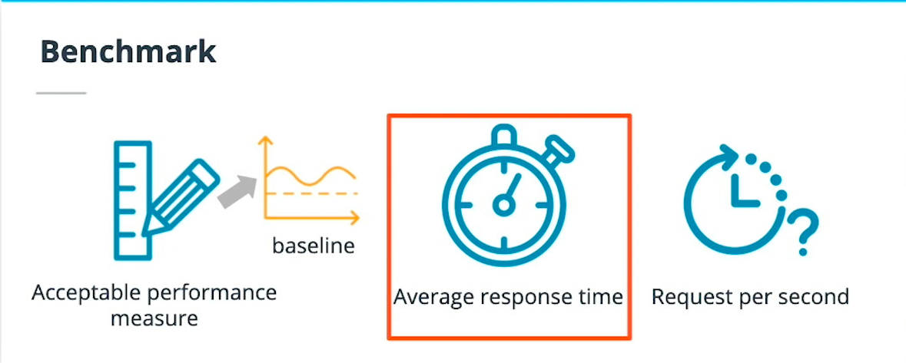
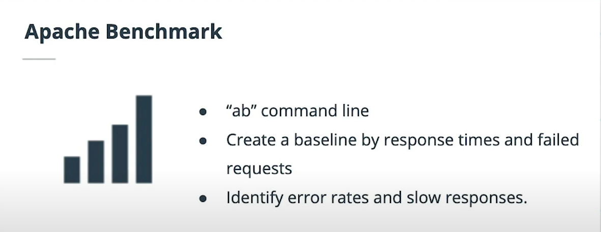
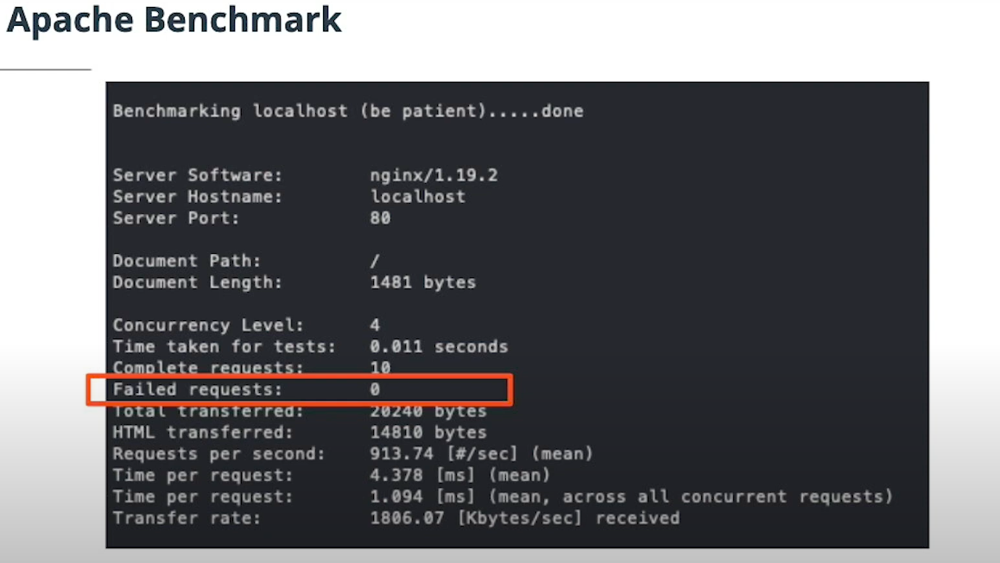

# Consume Endpoints

## Introduction 

	

---

* These endpoints allow other services to interact with deployed models. And in this lesson, you will learn all the key facts about interacting with them.

* There are some interesting details you need to be aware of when trying to use HTTP and you will go through each of these:

	* Swagger
	* Consuming deployed services
	* Benchmarking

#### New terms

* Swagger: A tool that eases the documentation efforts of HTTP APIs

* Benchmarking: being able to create a baseline of acceptable performance so that it can be compared to day-to-day behavior


---

## Creating a Benchmark

* you will interact with a deployed service and create a benchmark. 

* Interacting and creating a benchmark is critical for enhancing performance and detecting anomalies.

#### Further reading

* Chapter 4 of Python For DevOps covers benchmarking and other useful Linux utilities that can be useful.

---

## Swagger Documentation

* Swagger is a tool that helps build, document, and consume RESTful web services like the ones you are deploying in Azure ML Studio. 

* It further explains what types of HTTP requests that an API can consume, like POST and GET.

* Azure provides a swagger.json that is used to create a web site that documents the HTTP endpoint for a deployed model.


* Swagger example

	

---

#### New terms

* RESTful: A style for building HTTP endpoints that emphasizes separation of concerns

#### Further reading

* The Swagger homepage has in-depth examples and usage to dig further into other details.

* https://swagger.io/tools/swagger-ui/


---


## Swagger Documentation

#### Note: 
* In the video, the instructor used localhoston port 80 to display the Swagger page. It may not work for everyone. 

* If localhost doesn't work for you, check if you can use a different port other than 80, for example, port 9000. 

* Ensure that the updated port is used when trying to reach the swagger instance by localhost, for example localhost:9000.

* If you see code 400, message bad request version in the Python script, it means that you are using https instead of http in the Swagger page. Remember to use http only when accessing these URLs.


* In the Swagger.sh file, it has a command line:

`docker run -p 80:8080 swaggerapi/swagger-ui`

* This command runs the swagger UI container and makes it available on port 80. This will need to be updated in the lab because port 80 is being used already. Set the port to 9000 would be a good choice here. So the updated command will look like this:

`docker run -p 9000:8080 swaggerapi/swagger-ui`


* After the Swagger UI container is running, you can access the website on `http://localhost:9000`.

* Running serve.py is crucial so that the contents of swagger.json can be consumed locally by Swagger. If swagger.json is not present, or if the local server is not running, then Swagger will not be able to produce the docs.

* To give you more information: running serve.py is needed because Azure protects against CORS (Cross Origin Resource Sharing) and the server that hosts swagger.json needs to be allowed to happen. This is done in the script with the following method:

```python
    def end_headers(self):
        self.send_header("Access-Control-Allow-Origin", "*")
        SimpleHTTPRequestHandler.end_headers(self)
```

#### Note: 

* The above information is not closely related to the course and will not be tested in the final project. 

* It is just for those who are interested in the commands in serve.py.

* By default, the serve.py script will run and serve contents on localhost:8000 - this is an important detail because it is required as input in the Swagger UI page. The value that is required in the Swagger UI is http://localhost:8000/swagger.json. Please notice that you should use http instead of https.

---

## Consume Deployed Service

* You can consume a deployed service via an HTTP API. An HTTP API is a URL that is exposed over the network so that interaction with a trained model can happen via HTTP requests.

* Users can initiate an input request, usually via an HTTP POST request. HTTP POST is a request method that is used to submit data. The HTTP GET is another commonly used request method. HTTP GET is used to retrieve information from a URL. The allowed requests methods and the different URLs exposed by Azure create a bi-directional flow of information.

	

---

* The APIs exposed by Azure ML will use JSON (JavaScript Object Notation) to accept data and submit responses. It served as a bridge language among different environments.

	

---

#### New terms

* JSON: JavaScript Object Notation, also referred to as a "bridge language" used to make communication possible between two groups who do not share a native dialect

* GET request method: GET is a request method supported by HTTP. This method should only be used to retrieve data from a web server

* POST request method: POST is a request method supported by HTTP. This method requests that a web server accepts the data enclosed in the body of the request message

#### Further reading

* The "How to consume a web service" Azure documentation has good examples of further interactions with an endpoint.

* https://docs.microsoft.com/en-us/azure/machine-learning/how-to-consume-web-service


---

## Consume Deployed Service

* To interact with the endpoint, the provided endpoint.py script has everything you need, except for the full URL to the endpoint and the key to authenticate. 

* It is crucial to make the update to the correct URL and authentication key, otherwise, the script will not be able to produce log output.

* The authentication is passed in the request as part of the headers, as shown in this snippet:

```python
# Set the content type
headers = {"Content-Type": "application/json"}

# If authentication is enabled, set the authorization header
headers["Authorization"] = f"Bearer {key}"
```


* After deployment of a model, the next big item is consuming service to retrieve data. If there is anything incorrect in the deployed model, consuming the data from the service would allow identifying problems. 

* It is also a great way to validate (test) outputs are working as expected.

---

## Benchmark the Endpoint

* A benchmark is used to create a baseline or acceptable performance measure. Benchmarking HTTP APIs is used to find the average response time for a deployed model.

* One of the most significant metrics is the response time since Azure will timeout if the response times are longer than sixty seconds.

	

---

	

* Apache Benchmark is an easy and popular tool for benchmarking HTTP services. You will learn about it on the next page.

---

	
---

#### New terms

* Response Time: The time in seconds (or milliseconds) that service takes to produce a response

* Timeout: When a request is sent, this is an error when the server cannot produce a response in a given amount of time


#### Further reading

* The documentation website for the Apache Benchmark Tool goes deep into all the options needed to benchmark almost any URL.

* https://httpd.apache.org/docs/2.4/programs/ab.html


---

## Benchmark the Endpoint

* Benchmarking services is an interesting topic. Everyone likes to have a highly performant endpoint, but the answer to what it takes to have a performant endpoint varies. 

* It is useful to create a baseline for benchmarks so that comparing subsequent results is meaningful.

* The benchmark.sh script doesn't have much code at all in it. It does include the ab command that runs against the selected endpoint using the data.json file created by the same endpoint.py file you used in the previous exercise. The ab command looks like this:

`ab -n 10 -v 4 -p data.json -T 'application/json' -H 'Authorization: Bearer SECRET' http://URL.azurecontainer.io/score`


* After running the benchmark.sh or simply after running the above command, you will see the output of requests sent to and responses from the endpoint, and at the end, a summary with key information to determine response performance.

* In this exercise use the Apache Benchmark command-line tool (ab) to generate lots of HTTP POST requests to get performance metrics out of the Azure Container Instance.

Make sure you have the Apache Benchmark command-line tool installed and available in your path:

`$ which ab
/usr/bin/ab
`

`$ ab --help
Usage: ab [options] [http[s]://]hostname[:port]/path
Options are:
...
`

---

## Curating Data Input

* There are some key items to ensure when sending data to a deployed endpoint. 

* ou need to make sure that the keys and values are following the constraints. 

* For example, if one field is repeated, this could potentially cause an error response, or if the format needs a date and time as a string, rather than an integer.

* Remember, using values that the service doesn't expect would produce an error response.


---

#### Glossary

* Benchmarking: being able to create a baseline of acceptable performance so that it can be compared to day-to-day behavior

* GET request method: GET is a request method supported by HTTP. This method should only be used to retrieve data from a web server

* JSON: JavaScript Object Notation, also referred to as a "bridge language" used to make communication possible between two groups who do not share a native dialect

* POST request method: POST is a request method supported by HTTP. This method requests that a web server accepts the data enclosed in the body of the request message

* RESTful: A style for building HTTP endpoints that emphasizes separation of concerns

* Response Time: The time in seconds (or milliseconds) that service takes to produce a response

* Swagger: A tool that eases the documentation efforts of HTTP APIs

* Timeout: When a request is sent, this is an error when the server cannot produce a response in a given amount of time

---


