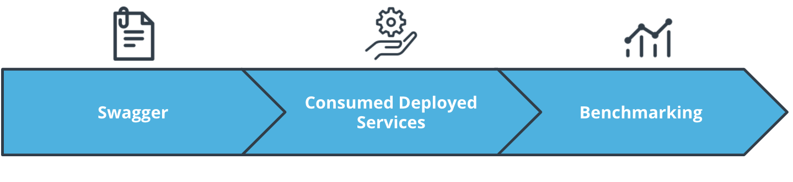
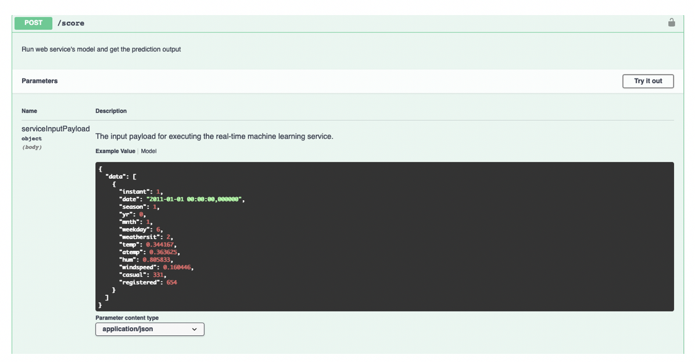
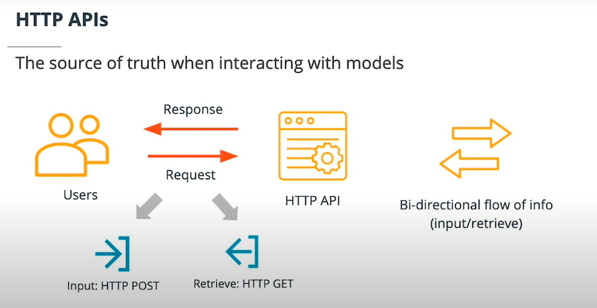
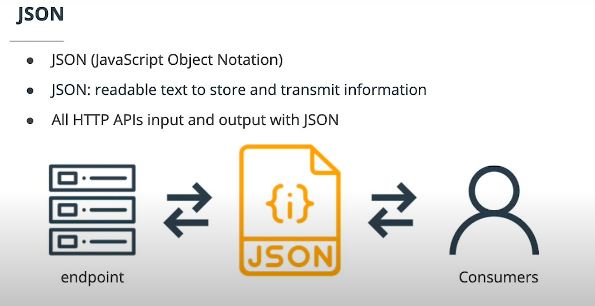

# Consume Endpoints

## Introduction 

	

---

* These endpoints allow other services to interact with deployed models. And in this lesson, you will learn all the key facts about interacting with them.

* There are some interesting details you need to be aware of when trying to use HTTP and you will go through each of these:

	* Swagger
	* Consuming deployed services
	* Benchmarking

#### New terms

* Swagger: A tool that eases the documentation efforts of HTTP APIs

* Benchmarking: being able to create a baseline of acceptable performance so that it can be compared to day-to-day behavior


---

## Creating a Benchmark

* you will interact with a deployed service and create a benchmark. 

* Interacting and creating a benchmark is critical for enhancing performance and detecting anomalies.

#### Further reading

* Chapter 4 of Python For DevOps covers benchmarking and other useful Linux utilities that can be useful.

---

## Swagger Documentation

* Swagger is a tool that helps build, document, and consume RESTful web services like the ones you are deploying in Azure ML Studio. 

* It further explains what types of HTTP requests that an API can consume, like POST and GET.

* Azure provides a swagger.json that is used to create a web site that documents the HTTP endpoint for a deployed model.


* Swagger example

	

---

#### New terms

* RESTful: A style for building HTTP endpoints that emphasizes separation of concerns

#### Further reading

* The Swagger homepage has in-depth examples and usage to dig further into other details.

* https://swagger.io/tools/swagger-ui/


---


## Swagger Documentation

#### Note: 
* In the video, the instructor used localhoston port 80 to display the Swagger page. It may not work for everyone. 

* If localhost doesn't work for you, check if you can use a different port other than 80, for example, port 9000. 

* Ensure that the updated port is used when trying to reach the swagger instance by localhost, for example localhost:9000.

* If you see code 400, message bad request version in the Python script, it means that you are using https instead of http in the Swagger page. Remember to use http only when accessing these URLs.


* In the Swagger.sh file, it has a command line:

`docker run -p 80:8080 swaggerapi/swagger-ui`

* This command runs the swagger UI container and makes it available on port 80. This will need to be updated in the lab because port 80 is being used already. Set the port to 9000 would be a good choice here. So the updated command will look like this:

`docker run -p 9000:8080 swaggerapi/swagger-ui`


* After the Swagger UI container is running, you can access the website on `http://localhost:9000`.

* Running serve.py is crucial so that the contents of swagger.json can be consumed locally by Swagger. If swagger.json is not present, or if the local server is not running, then Swagger will not be able to produce the docs.

* To give you more information: running serve.py is needed because Azure protects against CORS (Cross Origin Resource Sharing) and the server that hosts swagger.json needs to be allowed to happen. This is done in the script with the following method:

```python
    def end_headers(self):
        self.send_header("Access-Control-Allow-Origin", "*")
        SimpleHTTPRequestHandler.end_headers(self)
```

#### Note: 

* The above information is not closely related to the course and will not be tested in the final project. 

* It is just for those who are interested in the commands in serve.py.

* By default, the serve.py script will run and serve contents on localhost:8000 - this is an important detail because it is required as input in the Swagger UI page. The value that is required in the Swagger UI is http://localhost:8000/swagger.json. Please notice that you should use http instead of https.

---

## Consume Deployed Service

* You can consume a deployed service via an HTTP API. An HTTP API is a URL that is exposed over the network so that interaction with a trained model can happen via HTTP requests.

* Users can initiate an input request, usually via an HTTP POST request. HTTP POST is a request method that is used to submit data. The HTTP GET is another commonly used request method. HTTP GET is used to retrieve information from a URL. The allowed requests methods and the different URLs exposed by Azure create a bi-directional flow of information.

	

---

* The APIs exposed by Azure ML will use JSON (JavaScript Object Notation) to accept data and submit responses. It served as a bridge language among different environments.

	

---

#### New terms

* JSON: JavaScript Object Notation, also referred to as a "bridge language" used to make communication possible between two groups who do not share a native dialect

* GET request method: GET is a request method supported by HTTP. This method should only be used to retrieve data from a web server

* POST request method: POST is a request method supported by HTTP. This method requests that a web server accepts the data enclosed in the body of the request message

#### Further reading

* The "How to consume a web service" Azure documentation has good examples of further interactions with an endpoint.

* https://docs.microsoft.com/en-us/azure/machine-learning/how-to-consume-web-service


