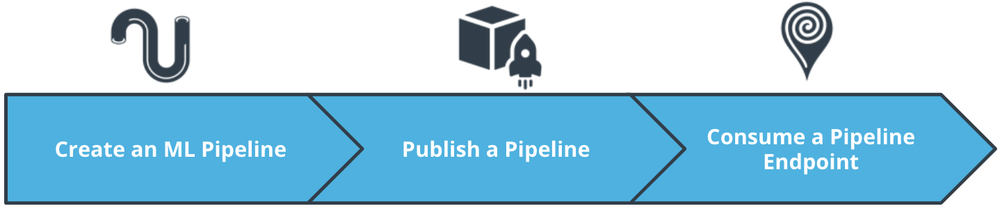
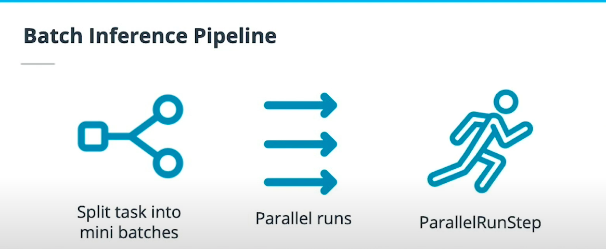
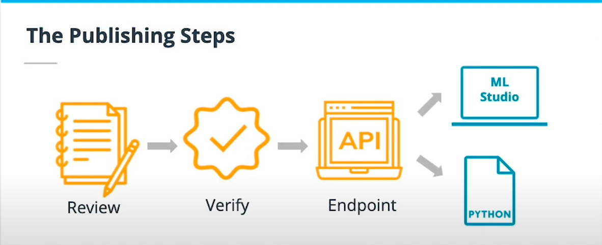
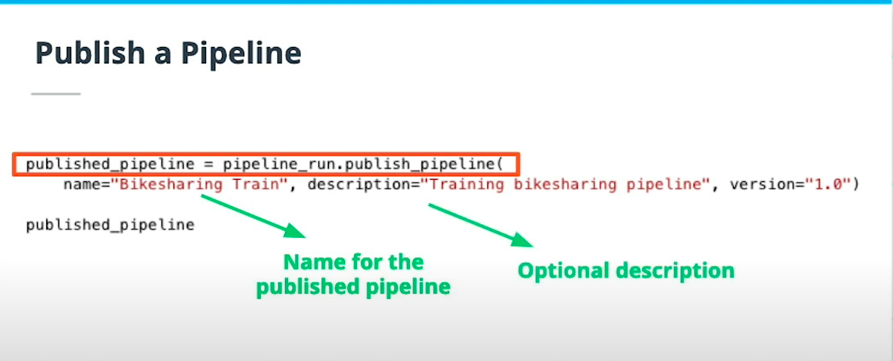
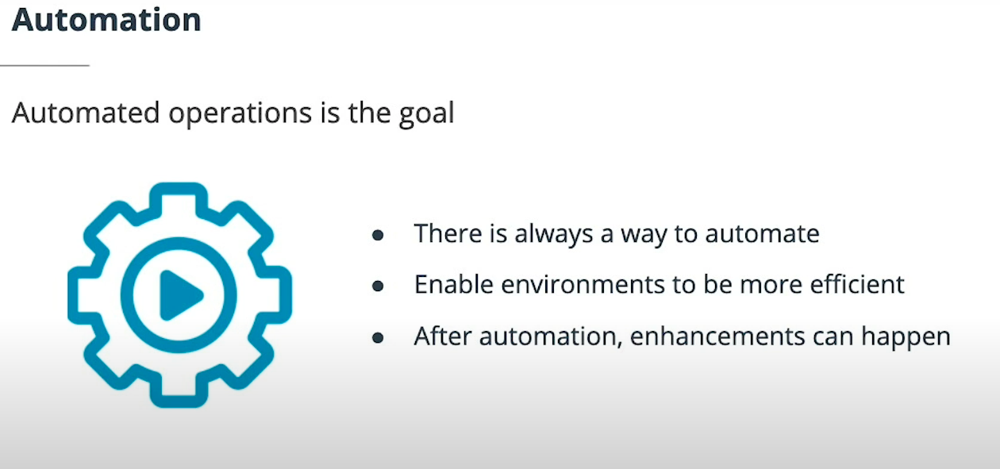
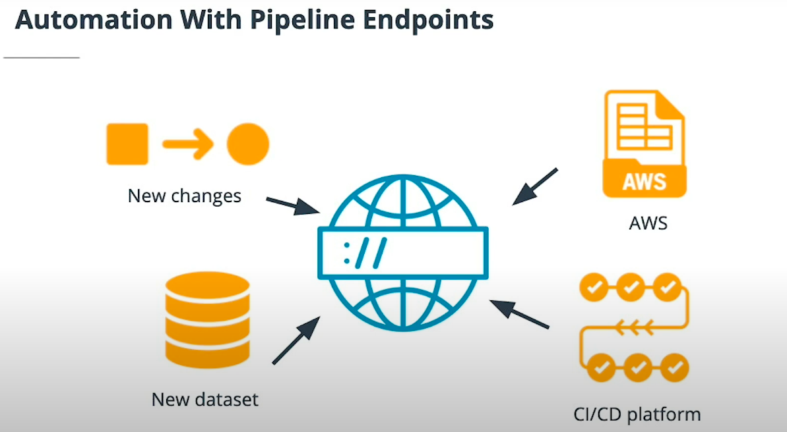
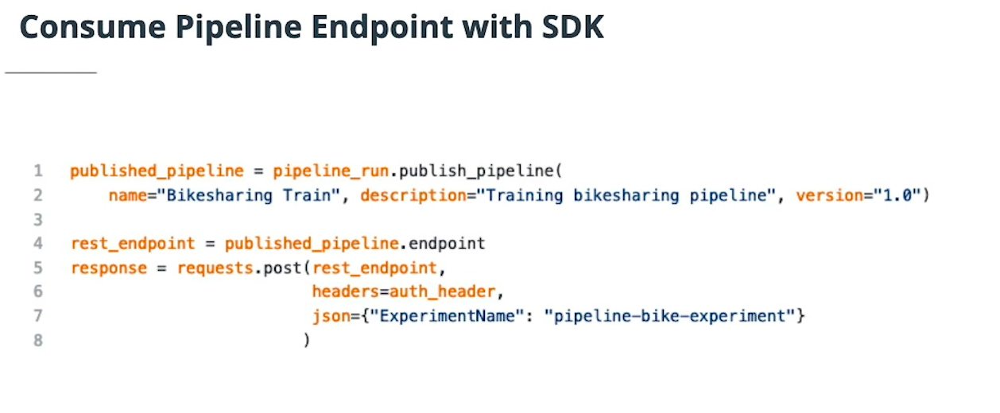

# Pipeline Automation


## Introduction 



* we will go into more detail about automation. Automation is a core pillar of DevOps applicable to Machine Learning operations.

* A good feature of Azure is Pipelines, and these are closely related to automation. Some key factors covered about pipelines are:

	* Creating a pipeline (include batch inference pipeline)
	
	* Publishing a pipeline
	
	* Interacting with a pipeline via an HTTP API endpoint


#### New terms

* Automation: A core pillar of DevOps which is applicable to Machine Learning


#### Further reading

* "What are Machine Learning Pipelines" has good information about Pipelines and how they related to Machine Learning.

* https://docs.microsoft.com/en-us/azure/machine-learning/concept-ml-pipelines

---

## Automation

* A great way to automate workflows is via Pipelines. This lesson covers publishing as well as interacting with them. Published pipelines allow external services to interact with them so that they can do work more efficiently.

---

## Create a pipeline

* The most common SDK class is the Pipeline class. You will use this when creating a Pipeline. Pipelines can take configuration and different steps, like AutoML for example.

* Different steps can have different arguments and parameters. Parameters are just like variables in a Python script.

* There are areas you can play with when creating a pipeline and we covered two:

	* Use pipeline parameters
	* Recurring Scheduled Pipelines
	* Batch Inference Pipelines


* This is the most common Python SDK class you will see when dealing with Pipelines. Aside from accepting a workspace and allowing multiple steps to be passed in, it uses a description that is useful to identify it later.


```python
from azureml.pipeline.core import Pipeline

pipeline = Pipeline(
    description="pipeline_with_automlstep",
    workspace=ws, 
    steps=[automl_step])
```


### Using Pipeline Parameters

* Pipeline parameters are also available as a class. You configure this class with the various different parameters needed so that they can later be used.

* In this example, the avg_rate_param is used in the arguments attribute of the PythonScriptStep.


```python
from azureml.pipeline.steps import PythonScriptStep
from azureml.pipeline.core import PipelineParameter

avg_rate_param = PipelineParameter(name="avg_rate", default_value=0.5)
train_step = PythonScriptStep(script_name="train.py",
                              arguments=["--input", avg_rate_param],
                              target=compute_target,
                              source_directory=project_folder)

```


### Scheduling a recurring Pipeline

* To schedule a Pipeline, you must use the ScheduleRecurrence class which has the information necessary to set the interval.

* Once that has been created, it has to be passed into the create() method of the Schedule class as a recurrence value.


```python
from azureml.pipeline.core.schedule import ScheduleRecurrence, Schedule

hourly = ScheduleRecurrence(frequency="Hourly", interval=4)
pipeline_schedule = Schedule.create(ws, name="RecurringSchedule", 
                            description="Trains model every few hours",
                            pipeline_id=pipeline_id, 
                            experiment_name="Recurring_Pipeline_name", 
                            recurrence=hourly)
```

### Batch Inference Pipeline




---


* One of the core responsibilities of a batch inference pipeline is to run in parallel. For this to happen, you must use the ParallelRunConfig class which helps define the configuration needed to run in parallel.

* Some important aspects of this are the script that will do the work (entry_script), how many failures it should tolerate (error_threshold), and the number of nodes/batches needed to run (mini_batch_size, 5 in this example).


```python

from azureml.pipeline.steps import ParallelRunConfig

parallel_run_config = ParallelRunConfig(
    source_directory='scripts',
    entry_script="scoring.py",
    mini_batch_size="5",
    error_threshold=4,
    output_action="append_row",
    environment=batch_env,
    compute_target=aml_target,
    node_count=5)

parallelrun_step = ParallelRunStep(
    name="batch-score",
    parallel_run_config=parallel_run_config,
    inputs=[batch_data_set.as_named_input('batch_data')],
    output=output_dir,
    arguments=[],
    allow_reuse=True
)

# create the pipeline
pipeline = Pipeline(workspace=ws, steps=[parallerun_step])
```

#### New terms

* Batch inference: The process of doing predictions using parallelism. In a pipeline, it will usually be on a recurring schedule

* Recurring schedule: A way to schedule pipelines to run at a given interval

* Pipeline parameters: Like variables in a Python script, these can be passed into a script argument


#### Further reading

* The Batch inference announcement from Microsoft has very good insight as to what can these types of Pipelines do.

* https://techcommunity.microsoft.com/t5/azure-ai/batch-inference-in-azure-machine-learning/ba-p/1417010


--- 


## Publish a Pipeline




---

* Publishing a pipeline is the process of making a pipeline publicly available. You can publish pipelines in Azure Machine Learning Studio, but you can also do this with the Python SDK.

* When a Pipeline is published, a public HTTP endpoint becomes available, allowing other services, including external ones, to interact with an Azure Pipeline.




---

### Automation with pipelines




---


* Pipelines are all about Automation. Automation connects different services and actions together to be part of a new workflow that wasn’t possible before.

* There are some good examples of how different services can communicate to the pipeline endpoint to enable automation.

	* A hosted project using version control: when a new change gets merged, a trigger is created to send an HTTP request to the endpoint and train the model.

	* A newer dataset gets uploaded to a storage system that triggers an HTTP request to the endpoint to re-train the model.

	* Several teams that want to use AutoML with datasets that are hosted externally can configure the external cloud provider to trigger an HTTP request when a new dataset gets saved.

	* A CI /CD platform like Jenkins, with a job that submits an HTTP request to Azure when it completes without error.




---


#### New terms

* HTTP Trigger: With configuration, a service can create an HTTP request based on certain conditions

* Publishing a Pipeline: Allowing external access to a Pipeline over an HTTP endpoint


#### Further reading

* The Azure documentation on how to create and run ML Pipelines is a good introduction to Pipelines in general, but also on publishing them.

* https://docs.microsoft.com/en-us/azure/machine-learning/how-to-create-your-first-pipeline

---


## Consume Pipeline Endpoint (API)

* Pipeline endpoints can be consumed via HTTP, but it is also possible to do so via the Python SDK. Since there are different ways to interact with published Pipelines, this makes the whole pipeline environment very flexible.

* It is key to find and use the correct HTTP endpoint to interact with a published pipeline. Sending a request over HTTP to a pipeline endpoint will require authentication in the request headers. We will talk more about it later.




#### New terms

* Pipeline endpoint: The URL of the published Pipeline

* HTTP Headers: Part of the HTTP specification, where a request can attach extra information, like authentication


#### Further reading

* The documentation on the Pipeline Endpoint class has some good information about methods that allow interacting with a pipeline.

* https://docs.microsoft.com/en-us/python/api/azureml-pipeline-core/azureml.pipeline.core.pipeline_endpoint.pipelineendpoint?view=azure-ml-py


